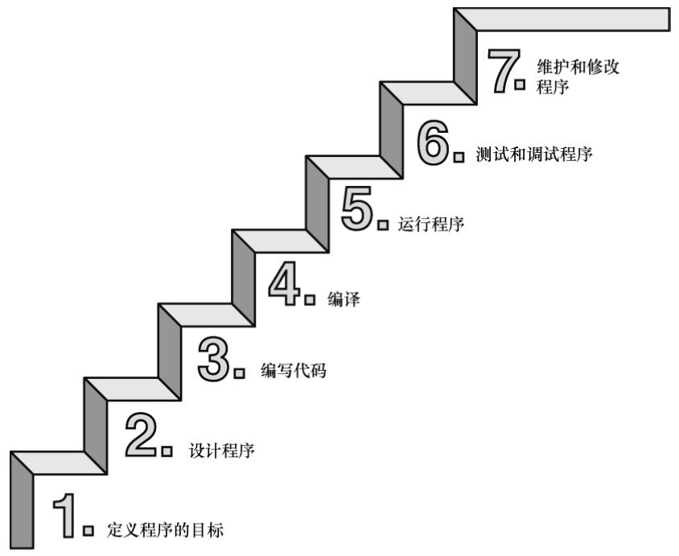
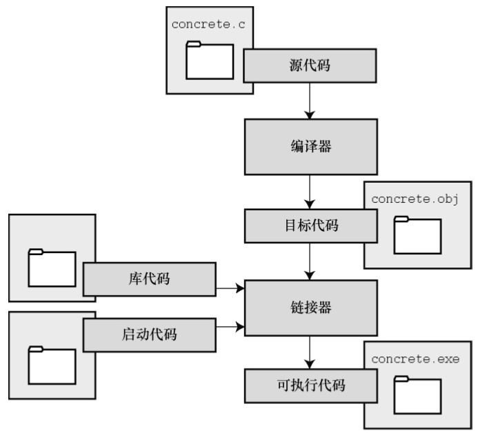

# 编程的七步骤



# 编译和连接



# 第二章

* `操作系统`和``C库``经常使用`一个或两个下划线`字符开始的标识符(也是为了和开发者的变量区分，自己写尽量不用开头下划线)
* `\t`退格键 `TAB键`
* 提高可读性，在函数中使用分割讲变量，语句，返回等分割开来，提高代码可读性

```c
__kcab
```

## 示例

```c
/*
	envir: DEVC 6.3
	Project: 简单的C程序
*/
// stdio ：standad input output . 
// h : header头文件
// 把文件内的所有内容都输入到改行所在为止，
// #inclue 预处理指令(preprocessor directive)
#include <stdio.h>   //预处理指令
// int 函数返回类型
int main(void)   // 主函数，函数入口
{  //函数体的开始
	/*函数体*/
	// 给变量命名要使用有意义的变量名或标识符
	// 编译器只能识别前63个字符，尽可能的简短
	// 可以使用小写字母，大写字母，数字和下划线来命名
	// 名称的第一个字符必须是字符或下划线
	int num  = 1;  // 变量命名可读性 ，=赋值
	
	{ //表示快
		printf("\tso simple sometime native\n");
		printf("My favorite number is %d\n",num);
	}

	return 0; //函数返回值，在main值中结束标志
}  // 函数体的结束
```

