# 概要

> 以选择题考察  `6分`左右  四颗星 年年考 注意侧重点
>
> 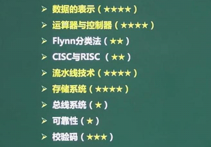

# 数据的表示

> 十进制转R进制使用**短除法**。

## 进制转换

> [进制转换](https://www.blog.foryouos.cn/Certificate/soft/work/%E8%BF%9B%E5%88%B6%E8%BD%AC%E6%8D%A2/)

## 数值表示范围

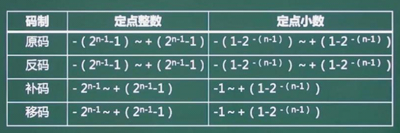

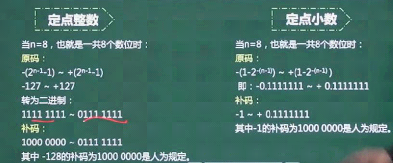

## 浮点的运算

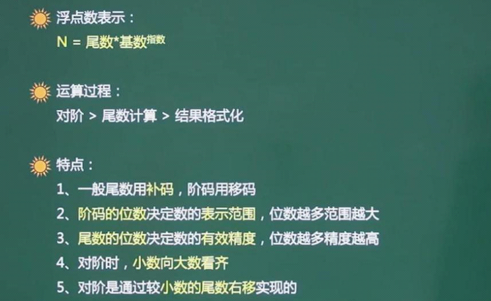

# 计算机结构


> * 运算器
>   * `算术逻辑单元ALU` ：`数据`的`算术运算`和`逻辑运算`
>   * 累加寄存器 `AC` ： 通用寄存器，为`ALU`提供`工作区`，用于暂存数据
>   * 数据缓存寄存器 `DR` ：写内存时，`暂存`指令或数据
>   * `状态`条件寄存器 `PSW`：`存状态标志`和`控制`标志 (其位置软考中有时位于运算器，有时位于控制器)  如 运算结果进位标志C 运算结果溢出标志 V 运算结果位0 标志Z 中断标志 I
> * 控制器
>   * `程序计数器PC` ： 存储`下一条`要`执行`指令的地址
>   * 指令寄存器 IR ： 存储即将执行的指令
>   * 指令译码器  ID  ： 对指令中的操作码字段进行分析解释
>   * 时序部件 (时间顺序) ：提供时序控制信号。
>   * 地址寄存器 AR (CPU当前要访问的)

## 哈佛结构

> 将指令和数据分来存储的计算机体系结构。将程序和数据存储在不同的存储空间中，即程序存储器和数据存储器是两个独立地存储器，每个存储独立编制，独立运行
>
> 特点:
>
> * 一般用于嵌入式系统处理器，数字信号处理(Digital Signal Processing , DSP )
> * 指令与数据分开存储，可以并行读取指令和数据，提高数据读取效率以及指令的执行效率
> * 总线数量多，有4条总线，指令的数据总线与地址总线，数据的数据总线与地址总线。
>
> 

# 计算机体系结构分类-Flynn

> 根据指令流和数据流特征对计算机系统畸形的分类
>
> 

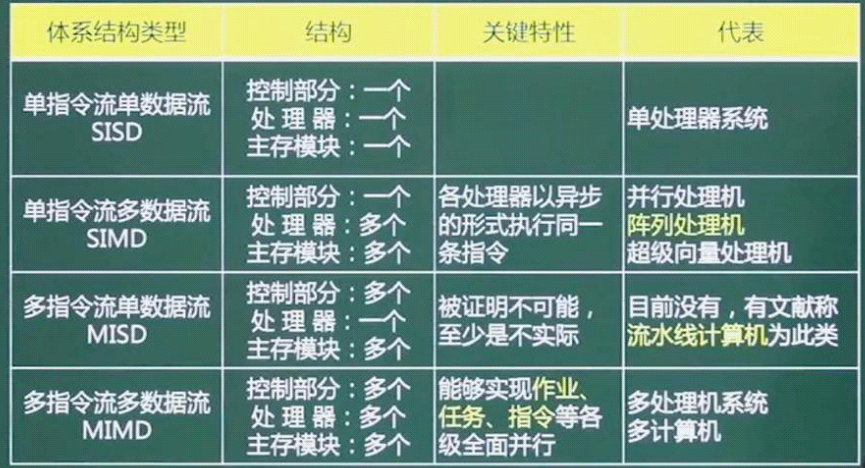

# 指令的基本概念

> 一条指令就是机器语言的一个语句，它是一组有意义的二进制代码，
>
> * 操作码字段
> * 地址码字段
>
> 操作码部分指出了计算机要执行什么性质的操作，如加法，减法，取数，存数等。地址码字段需要包含各操作数的地址及操作结果的存放地址等，从其地址结构的角度分为：
>
> * 三地址指令
> * 二地址指令
> * 一地址指令
> * 零地址指令
>
> 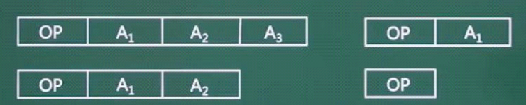

# 寻址方式

> * 立即寻址方式
> * 直接寻址方式
> * 间接寻址方式
> * 寄存器寻址方式
> * 寄存器间接寻址方式

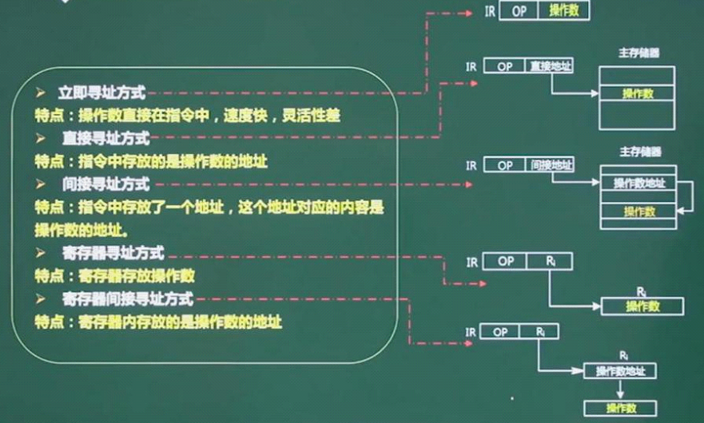

# CISC&RISC

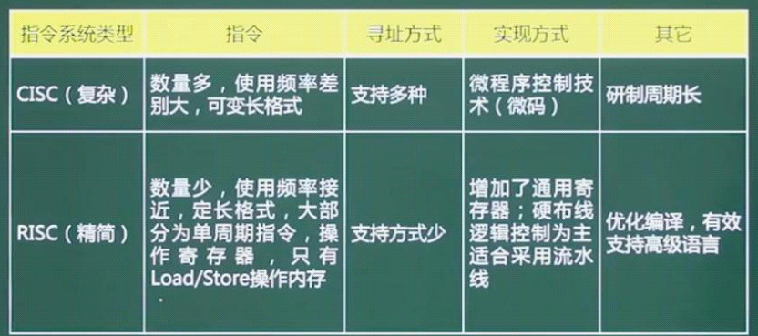

# 流水线技术

> 流水线是指在程序执行时多条指令重叠进行操作的一种准并行处理实现技术。各种部件同时处理十针对不同指令而言的，它们可同时为多条指令的不同部分进行工作，以提高各部件的利用率和指令的平均执行速度。

## 图解流水线

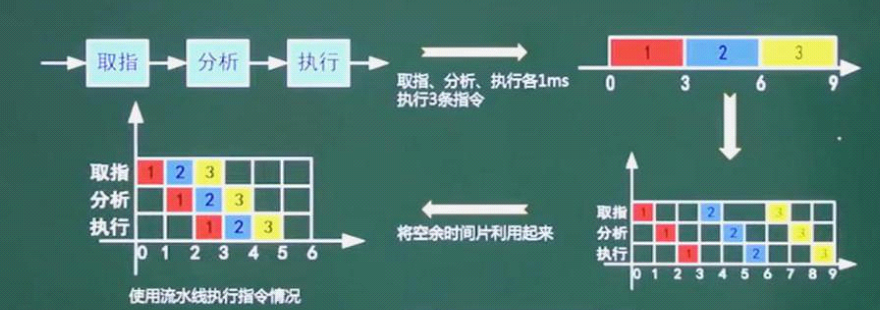

## 流水线的计算

计算  （先验证理论公式，理论公式找不到答案时，在使用实践公式)

* 流水线周期 为执行时间最长的一段
* 理论公式   ：**1条指令执行时间 + （指令条数 -1 ） x 流水线周期**
  * K : 一条指令分为几部分执行
  * n : 表示指令的条数
  * Δt ： 指令的周期时间

```
  (t1 + t2 + ... + tk) + (n - 1) * Δt
```

* 实践公式

```
（k + n -1）*  Δt
```

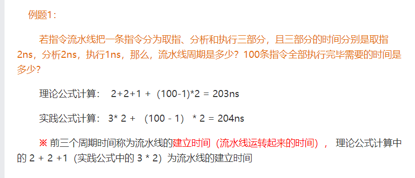

## 超标量流水线

>  度：若由`两条`**流水线**组成的`超标量流水线`，流水线`度` 为 `2`，增加流水线

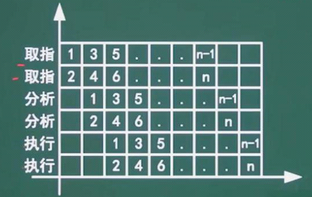

## 吞吐量

> 流水线吞吐率 （ Though Put Rate , TP )： 单位时间内流水线所完成的任务数量或输出的结果数量
>
> * 求吞吐率
>
> **TP = 指令条数 / 流水线执行时间**
>
> * 求最大吞吐率
>
> 


# 存储结构

## 层次化存储结构

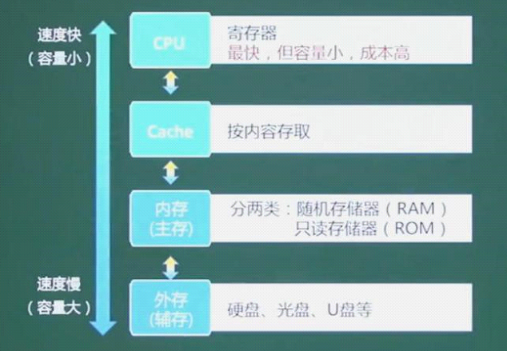

## Cache

> `Cache` 改善系统性能依据:  程序`局部性原理`  来防止 `抖动`

### 命中率

> * 命中率
>   * `t1`表示`Cache的周期时间`
>   * `t2`表示`主存储器周期时间`，以`读操作`为例
>   * 使用`Cache+主存储器`的系统的平均周期`t3`
>   * (1-h) 又称为 失效率(未命中率)

```
t3 = h x t1 + (1 -h) x t2
```

### Cache映像

> `Cache` 映像  ： 彼此间的优势和劣势  冲突率最高，最低
>
> 地址映像： 将主存与Cache的存储空间划分为若干大小相同的页(或称为块)
>
> * 某机主存容量为1GB，划分为2048页，每页512KB
> * Cache容量为8MB，划分为16页，每页512KB

#### 直接相联映像

> 硬件电路简单，但冲突率很高
>
> 每个内存区都和Cache块相对应，
>
> Cache块里有n块，内存就按照对应Cache大小进行分区，每个区都有n块，来进行一一对应。

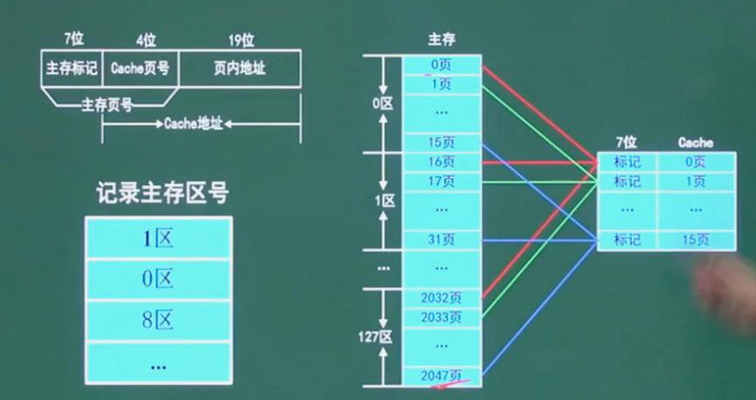

#### 全相联映像

> 电路难以设计和实现，只适用于小容量Cache，冲突率较低
>
> 不再分区，Cache有多大，内存就按这个带下分块，内存中的`每一块`都相当于`Cache中的副本`。

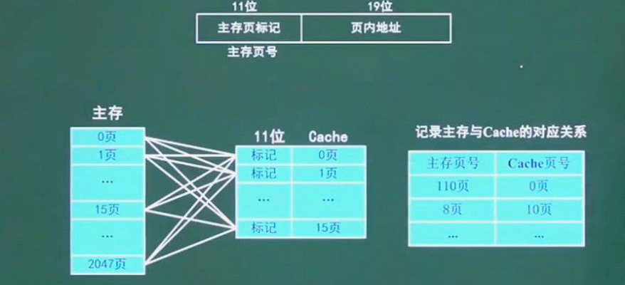

#### 组相联映像

> `直接相联`与`全相联` 的折中
>
> * 先分组  类似组组
> * 再分区 类似 直接相联

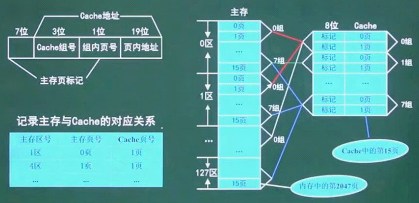

# 主存 编制与计算

> * 存储单元
> * 

# 总线

> 各部件连接的桥梁


# 求串联/并联 系统可靠性

> * 串联系统的可靠性：所有可靠性的乘积
> * 并联系统的可靠性 ： 先求失效的，将所有失效的乘起来，用1减去所有失效的乘积。
> * N模混合系统 ： 部分计算，并联按照并联方法，串联按照串联方法。

# 校验码

> * `码距`：任意一种编码都由许多码字构成，任何两个码字之间最少变化的二进制数就称为数据校验码的**0码距**
> * 奇偶校验的编码方式：由若干位有效信息(如一个字节)，再加上一个二进制位(校验位)组成校验码。奇偶简要，可检查1位的错误，不可纠错。
> * 奇校验
> * 偶校验
> * CRC循环校验码 : 可检错，不可纠错
>   * 多项式
> * 海明威校验码 ： 可检错，也可纠错(中级不要求)
>   * 需要多少位 计算公式 
>   * 原理 ： 使


# 参考资料

* [计算机体系结构Flynn](http://ylaihui.com/blog/article/9264)
* [系统架构师](http://ylaihui.com/blog/category/66?rootCategoryId=null)
* [十种寻址方式](https://blog.csdn.net/lixiaoting9181/article/details/109846970)


