# 操作系统

> `6~8分`
>
> 能够有效组织和管理系统中的各种`软/硬`件资源，合理地组织计算机系统工作流程，`控制程序`的执行，并且向用户提供一个`良好`的工作`环境`和`友好`的`接口`。
>
> * 通过`资源管理`，提高`计算机系统效率`
> * 改善人际界面
>
> 特性: `并发性`，`共享性`，`虚拟性`，`不确定性`。
>
> * 进程管理：`进程状态`，`前驱图`，`PV操作`，`死锁`，`银行家算法`
> * 存储管理：`段页`式存储，`页面置换`算法，
> * 文件管理：`绝对`路径与`相对`路径，`索引`文件，`位示图`
> * 作业管理
> * 设备管理：`虚设备`与`SPOOLING技术`

# 分类

> * `批处理/批作业`： 按照指令依次执行，较少人机交互，提高计算机效率
> * `分时处理操作系统`： 分时处理把`CPU`分成`很多碎片`，把`碎片`分给`作业`依次执行，就是分时系统分时操作
> * `实时操作系统`：系统运行`足够块`，在`可接受`的`时间范围内`，提交作业马上会产生结果
> * `网络操作系统`：网络相关功能：`共享文件夹`，`网络打印机`，`存储服务器`等
> * `分布式操作系统`：除具有网络操作系统功能外，同时具有`更高`的`可靠性`，`可扩展性`，`健壮性`等。分布式系统：网络中多个计算机，它们的`物理位置`可能`不在同一个区域`，多个计算机组合在一起，形成网络系统，通过分布式系统来进行资源的管理和调度。
> * `微机系统`：笔记本PC机基本上都属于微型计算机
> * `嵌入式操作系统`：工厂的工控机，安装嵌入式芯片，不像微机系统那么庞大，但它的性能，可靠性会好一些，可以根据实时性去进行定制，裁剪。拥有独立地实验场景。

# 进程管理

## 进程

> `进程`是程序在一个`数据集合上`运行的`程序`，它是系统进行`资源分配`和`调度`的一个`独立单位`。它由`程序块`，`进程控制块PCB`和`数据块`三部分组成

## 进程和程序区别

> `进程`是`程序`的一次执行过程，`没有程序`就`没有进程`。
>
> `程序`是`完成某个特定功能`的一系列`程序语句`的`集合`，只要不被破坏，它就永远存在，`程序`是一个`静态`的概念，而进程是一个`动态`的概念，它由创建而产生，完成任务后`因撤销`而`消亡`，`进程`是系统进行`资源分配`和`调度`的`独立单位`，而`程序不是`。

> 三态模型：
>
> * `运行态`：进程已经获得了`CPU资源`且`正在执行`。
> * `就绪态`：进程已经`万事具备`，`只欠`东风(`CPU`资源)。
> * `等待态`：等待`其它需要运行`的资源`准备好`。例如`等待用户输入`，或者从`外设获`取相关信息过来的`状态`。

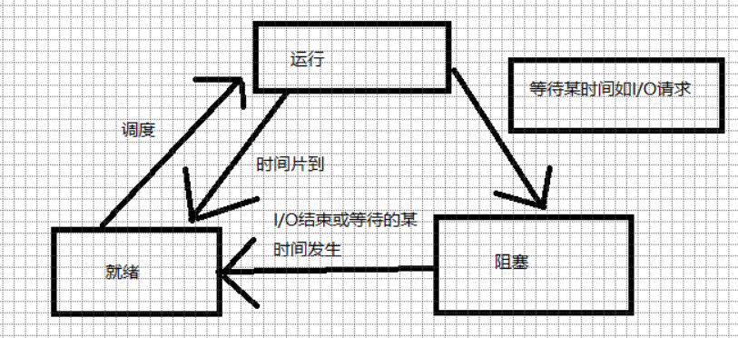

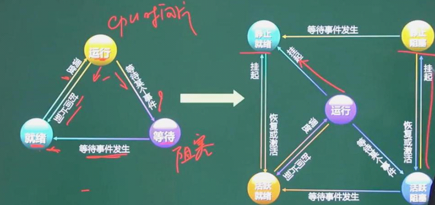

## 进程同步与互斥

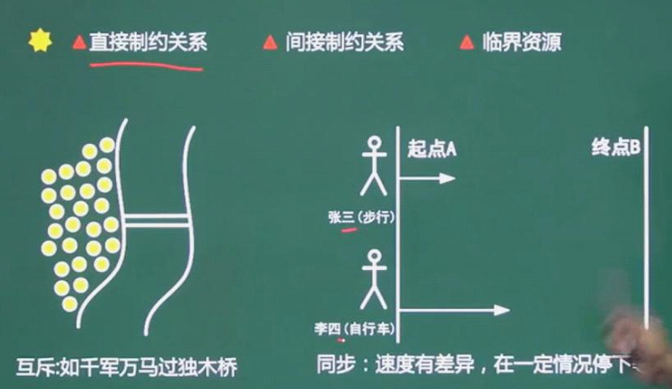

> 进程控制：是指对`进程创建`到消亡的整个生命过程进行全程控制
>
> `原语`：为了实现`一定目的`，由`一系列指令`组成`指令集`，其原子特性是不可再分割的。原语里面的指令，要么都执行，要么`都不执行`，执行完成以后就实现了一个目的的代码。
>
> `同步`：两个进程协作去做某一件事情。结果一定是两个进程都达到了目前的目标，只要有一个没有达到或者没有实现，另一个必须等待。
>
> `互斥`：某个资源被其中一个进程占用以后，其他进程就`不能`使用这个资源，`必须等待`。
>
> `临界资源`：进程`都需要使用`的资源，称为`临界资源`，一般来说是互斥的，不会同时允许去使用
>
> `临界区`：临界区指的就是程序帧要`使用临界资源`的代码。

## `PV`操作

> * 临界资源：`诸进程间`需要互斥方式对其进行`共享的资源`，如打印机，磁带机等
> * 临界区：每个进程中`访问临界资源`的那段代码称为`临界区`
> * 信号量：是一种`特殊的变量` , S大于等于0表示某资源的可用数，S小于0则其绝对值表示阻塞队列中等待该资源的进程数。
> * `P`是荷兰语的`Passeren`,`V`是荷兰语的`Verhoog`
> * `P`是`申请资源`的操作，`V`是`释放资源`的操作
> * `P` 也是 `等待申请` 操作，`V`也是 `完成释放`

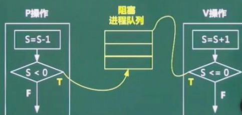

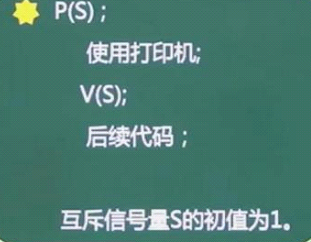

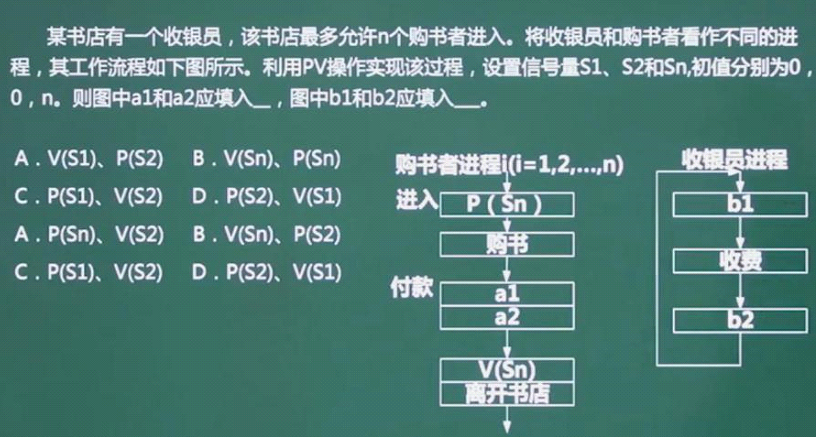

## 线程

> 某个`进程`下`多个线程`可以`共享`同一进程的`资源`，但是`每个线程`都独自拥有`程序计数器`，一组`寄存器`，`栈`等必须的资源。

## 进程资源图

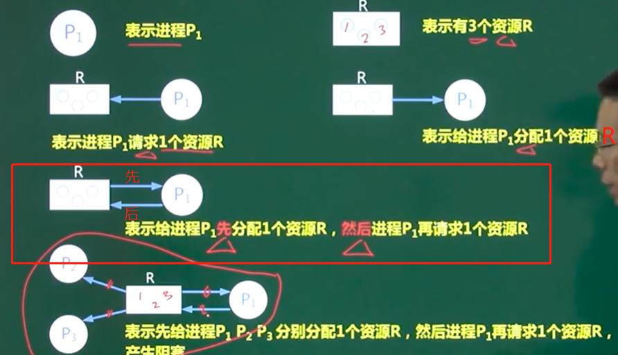

# 死锁

> `进程`管理是操作系统的`核心`，如果设计不当，就会出现`死锁问题`，如果一个进程在等待一件不可能发生的事情，则该进程就陷入`死锁`。
>
> 系统给所有进程分配`所`需资源数`少一个`，`系统留`一个资源。系统就`不会`陷入`死锁问题`

### 死锁条件

* `互斥`
* `环路等待`
* `保持`和`等待`
* `不剥夺`

### 死锁避免

* `有序资源`分配法
* `银行家算法`

# 存储管理

## 页式存储

> 将`程序`和内存`均划分`为同样大小的块，以`页为`单位(固定页大小，无形中拆分了`程序功能模块`将`程序`调入内存。
>
> `逻辑地址` =` 页号 `+ `页内地址`
>
> `物理地址` = `页帧号` +` 页内地址`
>
> 优点：`利用率高`，`碎片小`，`分配`及`管理简单`
>
> 缺点：`增加`了`系统开销`，可能产生`抖动现象`

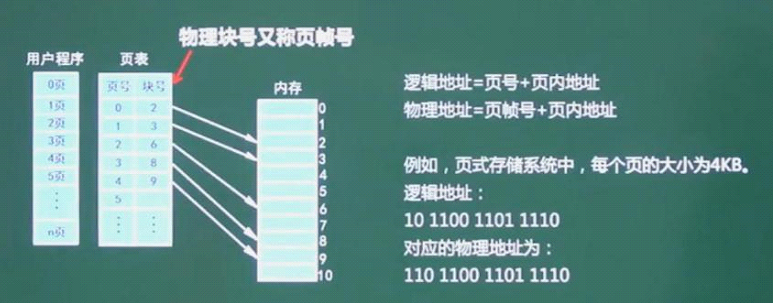

## 抖动

> 如果分配给进程的存储数量小于进程所需要饿最小值，进程的运行将会很频繁地产生缺页中断，这种频繁非常高的页面置换现象称为抖动。页面内存与外存之前频繁调度，以至于调度页面所需时间比进程实际运行时间还多，此时系统效率极具下降，导致系统崩溃。这种现象称为 颠簸或抖动。

## 段式存储

> 按用户作业中的自然段来划分逻辑空间，然后调入内存，段的长度可以不一样
>
> 段表要记录: `断号`，`段长`，`基址`
>
> 优点： 多道程序共享内存，各段程序修改互不影响
>
> 缺点：`内存利用率低`，`内存碎片`浪费`大`

## 段页式存储

> `段式`和`页式`的`综合体`，`先分段`，`再分页`。`1个`程序有`若干个段`，`每个段`中可以`有若干页`，`每个页`的`大小相同`，但`每个段`的`大小不同`。

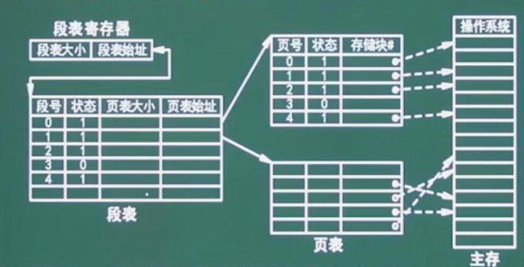

> * 优点： 空间浪费小，存储共享容易，存储保护容易，能动态连接
> * 缺点：由于管理软件的增加，复杂性和开销也随之增加，需要的`硬件`以及`占用的内容`也有`所增加`，使得`执行速度`大大`下降`。

## 页面置换算法

> * `最优`(Optimal ,OPT)算法
> * `随机算法`( `Rand` )
> * `先进先出` ( `FIFO `)算法：可能会产生`抖动`，
> * 最近最少使用`LRU`算法：不会`抖动`，`LRU`的理论依据是`局部性原理`
> * `时间局部性`：`刚被访问`的内容，`立即又被访问`
> * `空间局限性`：`刚被访问的内容`，`临近的空间`很快`被访问`。

## 磁盘管理

> `存取时间 = 寻道时间+等待时间`，`寻道时间`是指`磁头移动`到`磁道所需`的时间；`等待时间`为`等待读写的删去`转到`磁头下方所用的时间`。

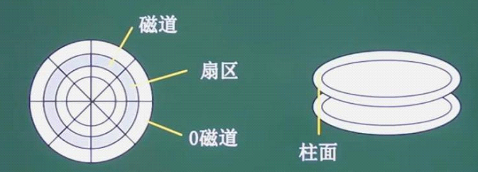

## 磁盘调度算法

* `先来先`服务（`FCFS`)
* `最短寻道`时间优先(`SSTF`)
* `扫描`算法（`SCAN`)
* `循环`扫描（`CSCAN`算法) : 又叫 `电梯算法`

> `读取磁盘数据`实现应包含的`三个部分`
>
> * `找磁道`的时间
> * 找`块(扇区)`的时间，即`旋转延迟`时间
> * `传输时间`

# 作业管理

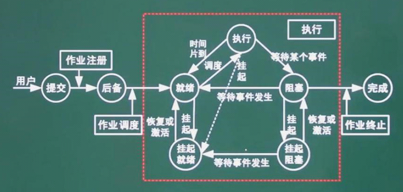

## 作业调度算法

* `先来先服务`
* `时间片轮转法`
* `短作业优先法`
* `最高优先权优先法`
* `高响应比优先法`：`作业等待时间/执行时间`

# 文件管理

## 索引文件结构

> 分为`13个`索引节点，从`0`开始 
>
> * 一级间接索引：`256K`
> * 物理盘快 ：` 64M`
> * 三级间接索引： `16G`

> `Linux`系统的`目录结构`，
>
> 考察`相对路径`，`绝对路径`。

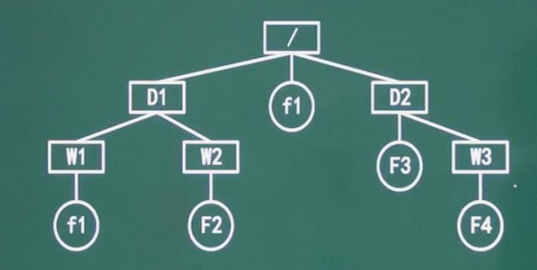

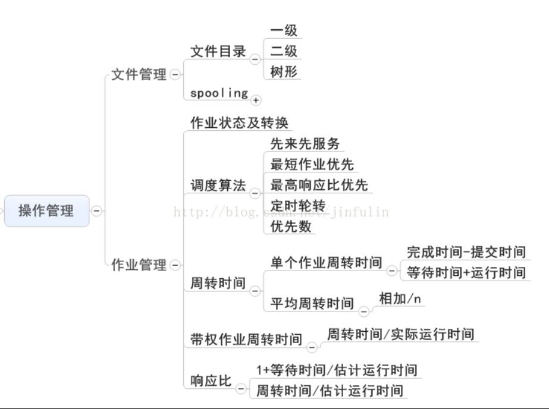

# 设备管理

## `数据传输控制`方式

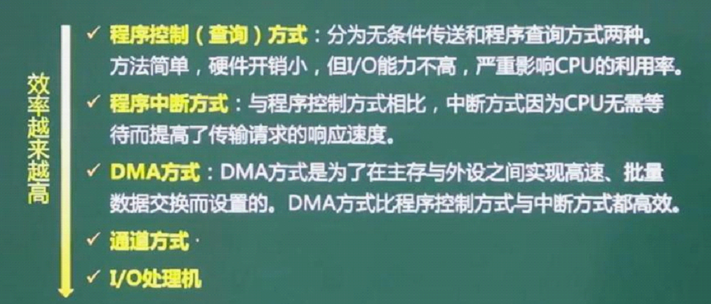

## SPOOLING技术

> `SPOOLing`是关于`慢速字符设备`如何与`计算机主机`交换信息的一种技术，通常称为`假脱机技术`，`SPOOLing`技术通过`磁盘实现`

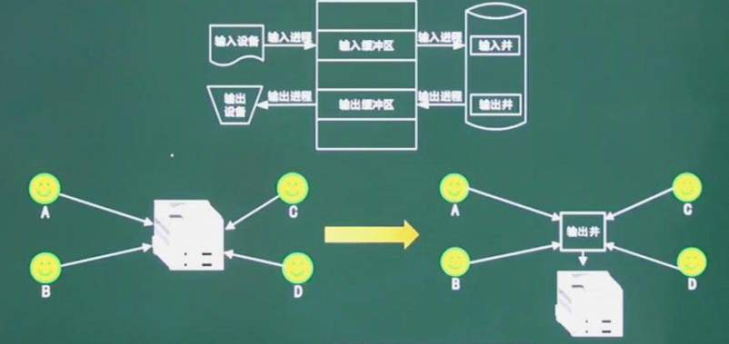

# 参考资料

