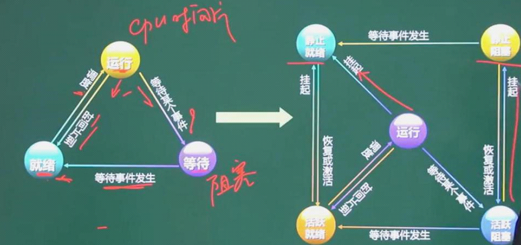
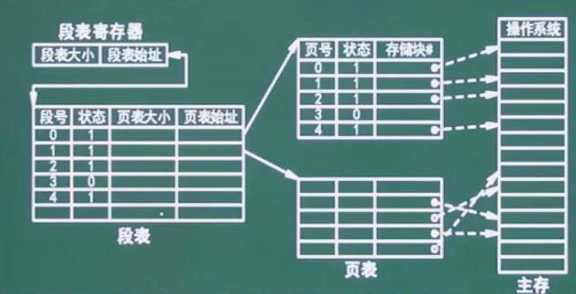
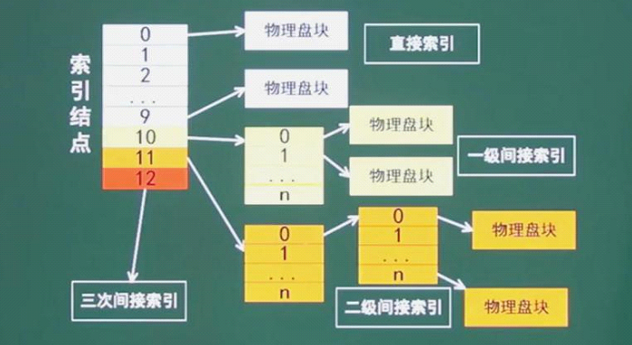
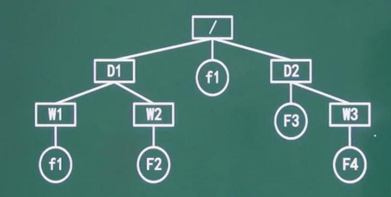
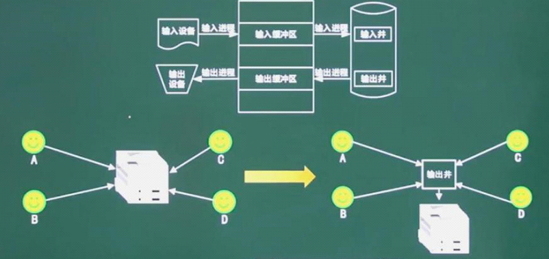

# 操作系统

> 6~8分
>
> * 进程管理：进程状态，前驱图，PV操作，死锁，银行家算法
> * 存储管理：段页式存储，页面置换算法，
> * 文件管理：绝对路径与相对路径，索引文件，位示图
> * 作业管理
> * 设备管理：虚设备与SPOOLING技术

# 进程管理

## 进程

> 进程是程序在一个数据集合上运行的程序，它是系统进行资源分配和调度的一个独立单位。它由程序块，进程控制块PCB和数据块三部分组成

## 进程和程序区别

> 进程是程序的一次执行过程，没有程序就没有进程。
>
> 程序是完成某个特定功能的一系列程序语句的集合，只要不被破坏，它就永远存在，程序是一个静态的概念，而进程是一个动态的概念，它由创建而产生，完成任务后因撤销而消亡，进程是系统进行资源分配和调度的独立单位，而程序不是。

## 进程同步与互斥

## `PV`操作

> * 临界资源：`诸进程间`需要互斥方式对其进行`共享的资源`，如打印机，磁带机等
> * 临界区：每个进程中`访问临界资源`的那段代码称为`临界区`
> * 信号量：是一种`特殊的变量`
> * `P`是荷兰语的`Passeren`,`V`是荷兰语的`Verhoog`
> * `P`是`申请资源`的操作，`V`是`释放资源`的操作
> * P 也是 等待申请 操作，V也是完成释放

## 死锁

> 进程管理是操作系统的核心，如果设计不当，就会出现死锁问题，如果一个进程在等待一件不可能发生的事情，则该进程就陷入死锁。
>
> 系统给所有进程分配所需资源数少一个，系统留一个资源。系统就不会陷入死锁问题

### 死锁条件

* 互斥
* 环路等待
* 保持和等待
* 不剥夺

### 死锁避免

* 有序资源分配法
* 银行家算法

# 存储管理

## 页式存储

> 将程序和内存均划分为同样大小的块，以页为单位(固定页大小，无形中拆分了程序功能模块)将程序调入内存。
>
> 逻辑地址 = 页号 + 页内地址
>
> 物理地址 = 页帧号 + 页内地址
>
> 优点：利用率高，碎片小，分配及管理简单
>
> 缺点：增加了系统开销，可能产生抖动现象

## 段式存储

> 按用户作业中的自然段来划分逻辑空间，然后调入内存，段的长度可以不一样
>
> 段表要记录: `断号`，`段长`，`基址`
>
> 优点： 多道程序共享内存，各段程序修改互不影响
>
> 缺点：内存利用率低，内存碎片浪费大

## 段页式存储

> 段式和页式的综合体，先分段，再分页。1个程序有若干个段，每个段中可以有若干页，每个页的大小相同，但每个段的大小不同。

> * 优点： 空间浪费小，存储共享容易，存储保护容易，能动态连接
> * 缺点：由于管理软件的增加，复杂性和开销也随之增加，需要的硬件以及占用的内容也有所正价，使得执行速度大大下降。

## 页面置换算法

> * 最优(Optimal ,OPT)算法
> * 随机算法(Rand)
> * 先进先出(FIFO)算法：可能会产生抖动，
> * 最近最少使用LRU算法：不会`抖动`，LRU的理论依据是`局部性原理`
> * 时间局部性：刚被访问的内容，立即又被访问
> * 空间局限性：刚被访问的内容，临近的空间很快被访问。

## 磁盘管理

> 存取时间 = 寻道时间+等待时间，寻道时间是指磁头移动到磁道所需的时间；等待时间为等待读写的删去转到磁头下方所用的时间。

## 磁盘调度算法

* `先来先`服务（`FCFS`)
* `最短寻道`时间优先(`SSTF`)
* `扫描`算法（`SCAN`)
* `循环`扫描（`CSCAN`算法) : 又叫 电梯算法

> * 读取磁盘数据实现应包含的三个部分
> * 找磁道的时间
> * 找块(扇区)的时间，即旋转延迟时间
> * 传输时间

# 作业管理

## 作业调度算法

* 先来先服务
* 时间片轮转法
* 短作业优先法
* 最高优先权优先法
* 高响应比优先法：`作业等待时间/执行时间`

# 文件管理

## 索引文件结构

> 分为13个索引节点，从0开始 
>
> * 一级间接索引：256K
> * 物理盘快 ： 64M
> * 三级间接索引： 16G

> Linux系统的目录结构，
>
> 考察相对路径，绝对路径。

# 设备管理

## 数据传输控制方式

## SPOOLING技术

> `SPOOLing`是关于慢速字符设备如何与计算机主机交换信息的一种技术，通常称为`假脱机技术`，`SPOOLing`技术通过磁盘实现

