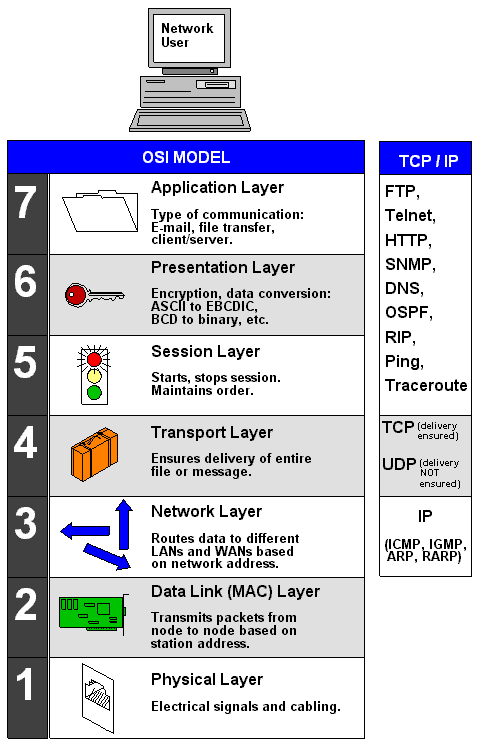

# 计算机网络

> 5分，
>
> * TCP/IP 协议族
> * IP地址与子网划分

## OSI模型

## TCP/IP 协议族

| 协议   | 端口  | 详情                                                   |
| ------ | ----- | ------------------------------------------------------ |
| POP3   | 110   | 邮件收取                                               |
| SMTP   | 25    | 邮件发送                                               |
| Telnet | 23    | 远程登录连接服务器，路由器，交换机等设备，进行远程登录 |
| FTP    | 20/21 | 文件传输协议                                           |
| SSH    | 22    | 安全远程登录协议                                       |
| HTTP   | 80    | 超文本传输协议，网页传输                               |
| HTTPS  | 443   | 超文本安全传输协议                                     |
| DHCP   | 67    | IP地址自动分配                                         |
| DNS    | 161   | 简单网路管理协议                                       |
| TCP    |       | 可靠传输协议                                           |
| UDP    |       | 不可靠传输                                             |
| ICMP   |       | 因特网控制协议，PING命令来自该协议                     |
| IGMP   |       | 组播协议                                               |
| ARP    |       | 地址解析协议，IP地址转换为MAC地址                      |
| RARP   |       | 反向地址解析协议，MAC地址转IP地址                      |

## 网络规划与设计

> * 需求分析
>   * 网络功能要求
>   * 性能要求
>   * 运行环境要求
>   * 可扩充性和可维护性要求
> * 网络规划原则
>   * 实用性原则
>   * 开放性原则
>   * 先进性原则
> * 网络设计与实施原则
>   * 可靠性 原则
>   * 安全性 原则
>   * 高效性原则 
>   * 可扩展性原则
> * 层次化网络设计
>   * 核心层
>   * 汇聚层
>   * 接入层

## 计算机网络分类

> * 按照分布范围分
>   * 局域网LAN
>   * 城域网 MAN
>   * 广域网 WAN
>   * 因特网 
> * 按拓扑结构分
>   * 总线型
>   * 星型
>   * 环型

## 网络接入技术

> * 有线接入
>   * 共用交换电话 PSTN
>   * 数字数据网 DDN
>   * 综合业务数字网 ISDN
>   * 非对称数字用户线路 ADSL
>   * 同轴光纤技术   HFC
> * 无线接入
>   * IEEE 802.11 (WIFI)
>   * IEEE 802.15 (蓝牙 Bluetooth)
>   * 红外 (IrDA)
>   * WAPI

# 信息安全

> 3分左右

## 对称加密

> 加密和解密使用同样规则(密钥)的算法
>
> * A选择某一种规则对信息进行加密
> * B使用同一规则(逆规则)对信息进行解密

> * 密钥传输过程中存在风险 （密钥分发困难)
> * 加密强度不高，但效率高
>
> 常见的对称加密算法：
>
> * `DES`
>
> 
>
> * 3DES(三重DES)
>
> 
>
> * RC-5
> * IDEA算法
> * AES加密
>
> 

## 非对称加密

> 加密和解密可以使用不同的规则，只要这两种规则存在对应关系即可
>
> * B根据`算法`生成`两把密钥`(`公钥` + `私钥`)，其中`私钥`是`保密`的，`公钥是公开`的，供要`与B通信`的`其它人使用`
> * `A从B`处`获取公钥`，并`用它来加密`
> * `B得`到`A加密后`的信息，用`私钥进行解密`，`完成通信`。

> * `公钥加密`，相应的`私钥解密` : 密钥必须`成对使用`
> * 加密`速度慢` (使用``两个密钥``)，但强度高
>
> 常见的非对称加密算法
>
> * RSA
>
> 
>
> * ECC

## 数字签名

> * 防止鉴别 ： 用于证明来源，接受者可以通过签名确定是哪个发送者进行的签名。
> * 防止抵赖 ： 防止发送者否定签名
> * 防止伪造  ： 防止接受者 伪造 发送者签名

> 使用`发送方的私钥加密`；用发送方的`公钥验证`，`是不是他发的`。

## 信息摘要

> 由`单向散列函数`加密成`固定长度`的`散列值`，(`不可逆`)
>
> 常用的`信息摘要算法`有 ： `MD5`, `SHA`，市场上`广泛使用`的`MD5`，`SHA`的散列值分别为`128 `和 `160` ，由于`SHA通常`采用的`密钥长度较长`，因此`性能`高于`MD5`.

## PKI公钥体系

> CA中心  `管理`密钥的`注册`，`更新`，`注销`。
>
> 

# 网络安全

> 物理层隔离技术 —  网闸(隔离) ， 屏蔽(网闸 子网)
>
> 数据链路层    —  链路加密 ，PPTP , L2TP
>
> 网络层 ：`物理`&`硬件` ` 防火墙` ，` IPSec`

## 被动攻击

> 监听(保密性)
>
> * 信息内容获取
> * 业务流分析

## 主动攻击

> * 中断(可用性)
> * 篡改(完整性)
> * 伪造(真实性)

## DoS(拒绝服务) & DDoS

> `DDOS 攻击` ： 在`短时间内`发起`大量请求`，`耗尽服务器资源`，`无法`响应`正常的访问`，造成`网站实质下线`。
>
> DOS 实施Denial of service 停止服务缩写。

> `假消息太多`，`处理的时候`，`真消息来了`没时间处理。

## 防火墙

> * 网络级
>   * `包过滤 `： 内部网络 – 屏蔽服务器 – Internet
>   * `状态检测`  ： 既能(状态表)保证速度与安全性
> * 应用级
>   * `双穴主机`
>   * `屏蔽主机`
>   * `屏蔽子网`(`DMZ`(`非军事区`))

> `DMZ区 `:  非安全性与安全性之前的缓存区(隔离区也称非军事化区) 其是为了解决 安装防火墙后外部网络的访问用户不能访问内部网络服务器的问题，而设立的一个非安全系统与安全系统之前的缓冲区。可部署web服务器，FTP服务器和论坛等。既要外网访问，又要内网访问，要放到安全区。

> * 病毒 ： 破坏计算机(破坏计算机功能&破坏数据)
> * 木马 ： 窃取计算机信息(黑客远程控制计算机工具)

# 参考资料

* [网络安全与信息安全](https://www.cnblogs.com/tuoqi/articles/16819791.html)
* [对称加密](https://blog.csdn.net/AtlanSI/article/details/110631873)
* [什么是数字签名](https://zhuanlan.zhihu.com/p/469646140)