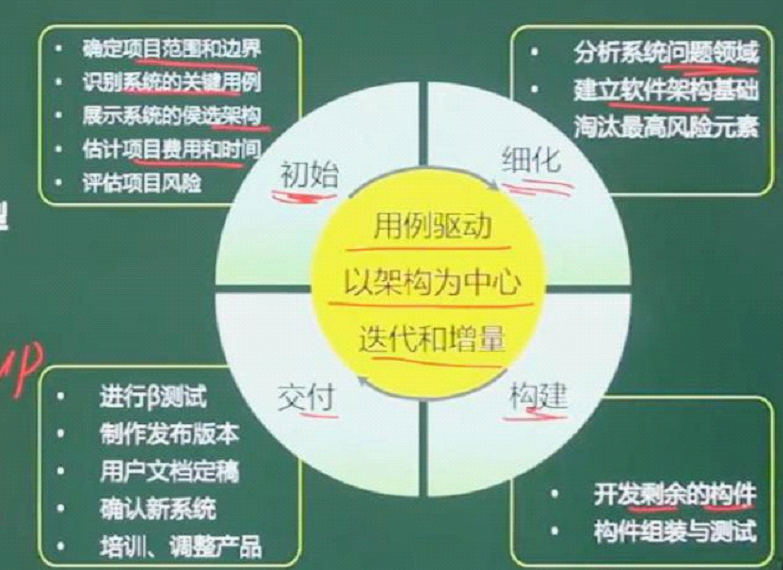
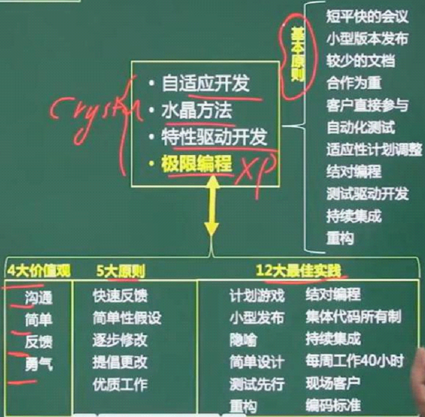
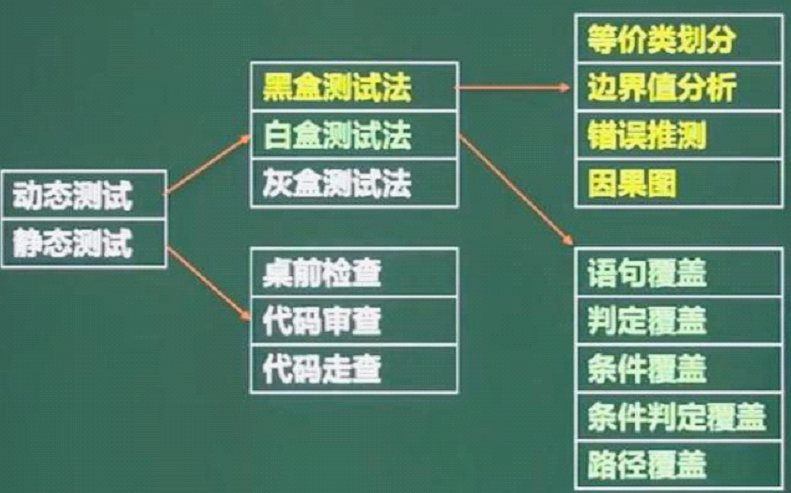
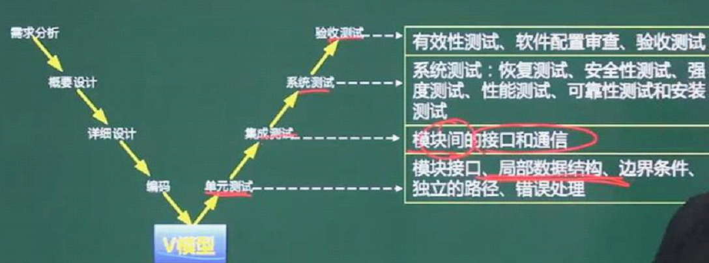
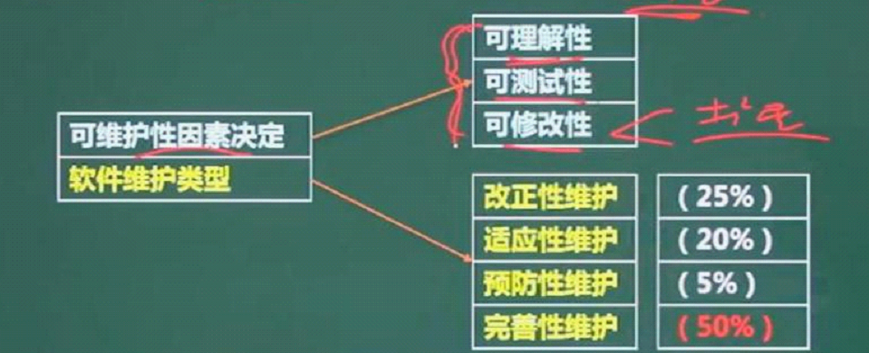
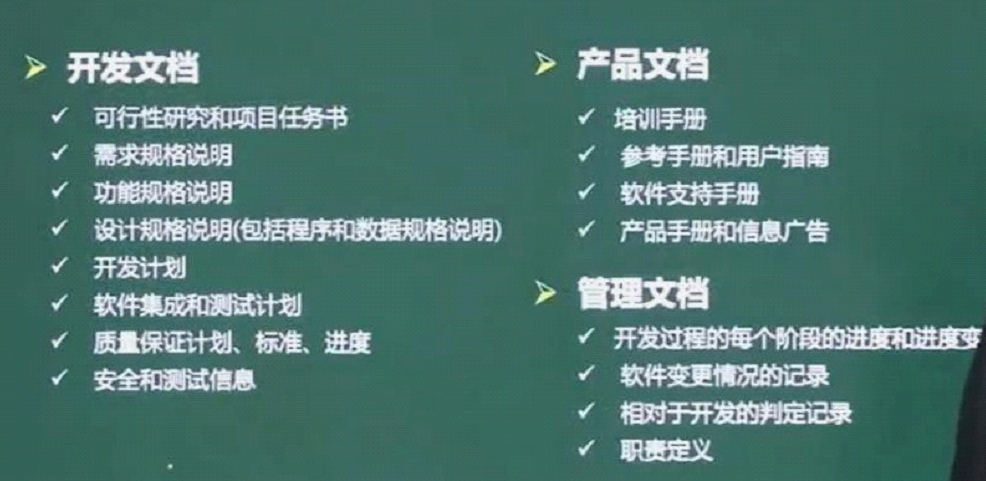
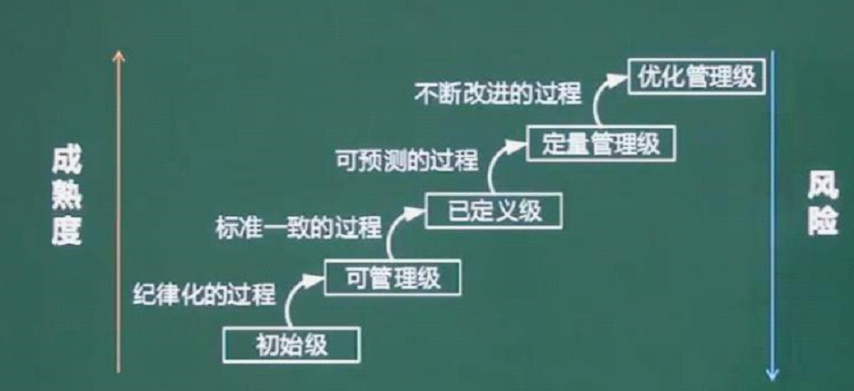
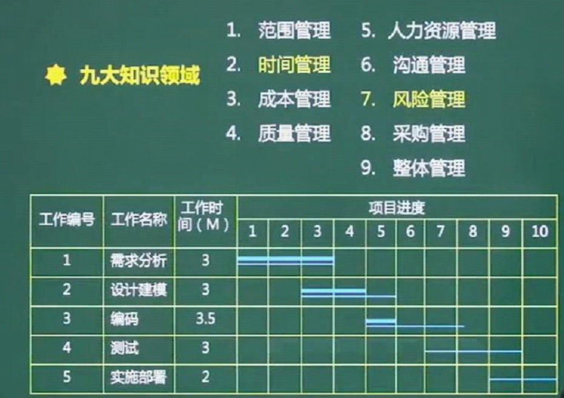
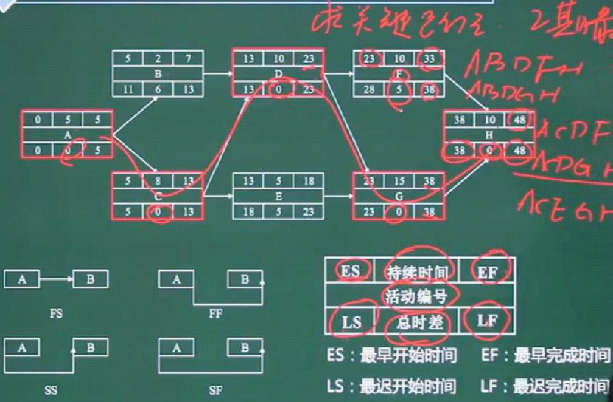
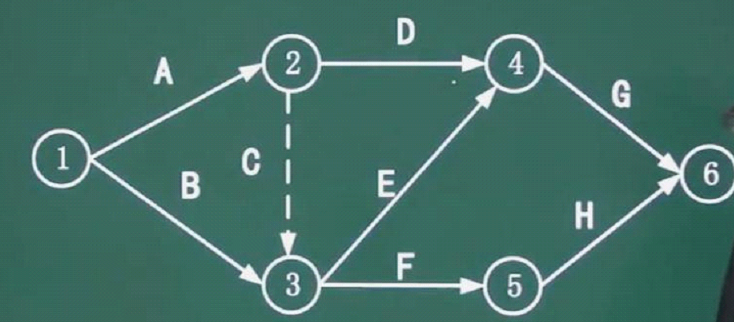

# 软件开发模型

## 瀑布模型

>  分为三个阶段：定义阶段，开发阶段，维护阶段。按照固定顺序而连接的若干阶段工作。
>
> `需求` ->` 设计 `- - > `编码 ` – > `测试 `—- > `维护`
>
> 瀑布模型为`线性开发`，必须`上一个阶段完成之后`且`审核通过`才能进入`下一个阶段`
>
> * 每个阶段都会产生`大量文档`
> * `开发周期长`，`项目时间长`
> * `适应需求变`化`能力差`
> * 由于公司对`成本`的`控制`相对`成本也较差`
>
> 优点：
>
> * 各阶段划分清晰
> * 强调计划与需求分析
> * 适合需求稳定产品开发
>
> 缺点:
>
> * 单一流程，不可逆
>
> * 风险显露晚，纠正机会少
>
> * 测试只是一个阶段，缺乏全过程测试思想
>
>   

## V模型

> 通过开发和测试同时进行的方式来缩短开发周期，提高开发效率。
>
> 优点：
>
> * 此模式更注重设计与测试，开发出来的产品质量有保证。
> * 相对于瀑布模型，V模型测试可以尽早的进入到开发阶段
>
> 缺点:
>
> * 虽然测试尽早的进入到开发阶段，但是真正进行软件测试是在编码之后，忽视了测试对需求分析，系统设计的验证，时间效率上大大折扣。
>
> 使用V模型一般为大型企业开发的大型软件，如银行外包，开发银行相关软件，开发时间一年半载，流程严格，质量要求也很高。

## 喷泉模型

> 也称为 面向对象的生存期模型，OO模型。
>
> 喷泉模型生存期的各个阶段可以相互重叠和多次反复，而且在项目的整个生存期还可以嵌入生存期，

## 原型化模型

> 适合于需求不明确的场景，可以帮助用户明确需求。
>
> 第一步：创建一个快速原型，能够满足项目干系人与未来的用户可以与原型进行交互，再通过与相关干系人进行充分的讨论与分析，最终弄清楚当前系统的需求，进行充分了解之后，在原型的基础上开发出用户满意的产品。

## 演化模型

> 主要针对事先不能完整定义需求的软件开发。用户可以给出待开发系统的核心需求，并且当看到核心需求实现后，能够有效地提出反馈，以支持系统的最终设计与实现。
>
> 在开发模式上采取分批循环开发的方法，每循环开发一部分的功能，它们成为这个产品的原型的新增功能。于是，设计就不断地演化出新的系统。

## 螺旋模型

> 一般在软件开发阶段需求不是很明确，采用渐进式开发模式。
>
> 是`渐进式` 的，强调的是`风险`，每个环里面都有风险分析这一阶段，每个环的工作都比前一环更多，是为了减少项目风险。
>
> 适合 ： 复杂度高，风险大，规模庞大
>
> 优点：
>
> * 强调项目的风险，即强调严格的全过程风险管理
> * 强调各开发阶段的质量
> * 提供机会检讨项目是否有价值继续下去
>
> 缺点：
>
> * 引入非常严格的风险识别，风险分析，风险控制，对风险管理的技术水平有更高的要求
> * 风险分析需要时间，添加成本 ，因而会造成项目进度缓慢。

## 统一过程

> 用例驱动为导向(注重功能的完善)，以软件架构为核心(严格的结构过程)，经过多次迭代(不像大瀑布模型一样一通到底)增量(可不断扩展的功能需求)的软件过程框架，由UML方法及其工具支持。

> 每个阶段都是一次迭代的过程，都要经历每个核心工作流程 –  –  `建模`，`需求捕获`，`分析`和`设计`，`实现 `…. 这些`典型`的`软件开发`流程。其中又根据`每个阶段`的`侧重点`各有`详略` ，根据`上图`可以`清晰`的开到`整个软件的`开发使用`统一过程建模`的开发流程。

### 模型4个阶段

> * 初始化阶段：建立业务模型和大概的需求分析
> * 细化阶段：完善模型和需求分析，做出分析设计以及相应的支持关键架构和服务代码，再反过来贩毒案分析合理性
> * 构建阶段：主要完成代码实现与相关配置
> * 移交(转换)阶段：将其部署到实际使用环境，做好维护准备，应对可能得更新升级问题。

### 6种实践方法

> * 迭代式开发
> * 持续不断地验证和维护软件质量
> * 管理需求(明确软件设计需求，以此为目标，阶段性朝目标前进)
> * 控制软件变更(在迭代过程中，明确和严格控制软件的更新方向)
> * 可视化建模(使用UML建立模型)
> * 基于构件的结构体系

## 敏捷方法

> 以人为核心，快速迭代，循序渐进的开发发送。强调以人为本，专注于交付对客户有价值的软件，是一个用于开发和维持复杂产品的结构，把一个大项分成对个相互联系，但也可独立运行的小项目，并分别完成，在此过程中软件一直处于可使用状态。
>
> 优点：
>
> * 注重市场快速反应能力，具体应对能力，客户前期满意度高
>
> 缺点：
>
> * 忽略对文档的重要性，若人员流动性较大，给维护带来不少难度。

* XP(Extreme PProgramming ,极限编程) ：适用于对费用控制严格的公司中使用，
* Cockburn水晶系列方法：用最少纪律约束而仍能够成功的方法，从而在产出效率与易于运作上达到一种平衡。
* 开源式源码：程序开发在地域上分布很广。

# 软件开发方法

> * 用户至上
> * 严格区分工作阶段，每阶段有任务和结果
> * 强调系统开发过程的整体性和全局性
> * 系统开发过程工程化，文档资料标准化
> * 自顶向下，逐步分解(求精)

# 原型法

# 面向对象方法

* 更好的复用性
* 关键在于建立一个全面，合理，统一的模型
* 分析，设计，实现三个阶段，界限不明确
* 面向服务的方法

# 需求分析

## 需求的任务

## 需求的过程

* 问题识别
* 分析与综合
* 编址需求分析文档
* 需求分析与评审

## 需求的分类

* 功能需求
* 非功能需求
* 设计约束

## 应用的工具

* 数据流图DFD
* 数据字典DD
* 判定表
* 判定树

#  软件设计

## 高内聚低耦合顺序(考点)

# 软件测试与维护

## 等价类划分

> 确定无效与有效等价类，设计用例尽可能多的覆盖有效类，设计用例只覆盖一个无效类。

## 边界值分析

> 处理边界情况时最容易出错，选取的测试数据应该恰好等于，稍小于或稍大于边界值。

## V模型测试

> * 回归测试
> * 负载测试
> * 压力测试

## McCabe环路复杂度

>  环路复杂度用来定量度量程序的逻辑复杂度。
>
> 在程序控制流程图中，节点是程序中代码的最小单元，边代表节点间的程序流。一个有e条边和n个节点的流程图F,可以用下述三种方法中的任何一种来计算环形复杂度。
>
> * `流图`中的`区域`数`等于`环形`复杂度`
> * 流图`G`的`环形复杂度`V(G) = E - N + 2， 其中，E是流图中 `边的条数`，`N是结点数`。****
> * 流图G的环形复杂度V(G) = P + 1，其中，P是流图中判定节点的数目。

## 软件维护

> * `适应性`维护：指使应用软件适应信息`技术变化`和`管理需求`变化而进行的修改。企业的外部市场环境和管理需求的不断变化也使得各级管理人员不断提出信息的信息需求
> * 完善性维护:扩充功能和改善性能而进行的修改，对已有软件系统添加，在系统分析和设计阶段中没有规定的功能与性能特性。

> 可维护性因素：主要以文档为主。

# 软件工程

## 文档管理

## 软件过程改进CMMI

# 项目管理

> 风险曝光度(Risk Exposure) : 计算方法，风险出现的概率乘以风险可能造成的损失。

# 时间管理

## 关键路径法

> 关键路径法沿着项目进度网络路线进行正向与反向分析，从而计算出所有计划活动理论上的最早时间与完成日期，最迟开始与完成日期，不考虑任何资源限制。

## 总时差(松弛时间)

> 在不耽误总工期的前提下，该活动的机动时间。活动的总时差等于该活动最迟完成时间与最早完成时间之差，或该活动最迟开始时间与最早开始时间之差。

## 活动排序

# 参考资料

* [软件开发常见模型汇总](https://blog.csdn.net/qq_41854911/article/details/131367786)
* [螺旋模型](https://blog.csdn.net/qq_46501800/article/details/104981195)
* [统一过程模型](https://blog.csdn.net/caqjeryy/article/details/124283831)