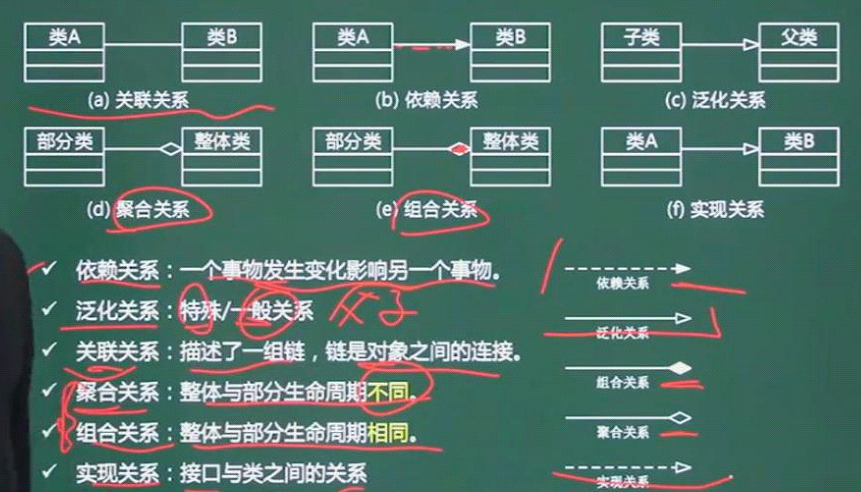
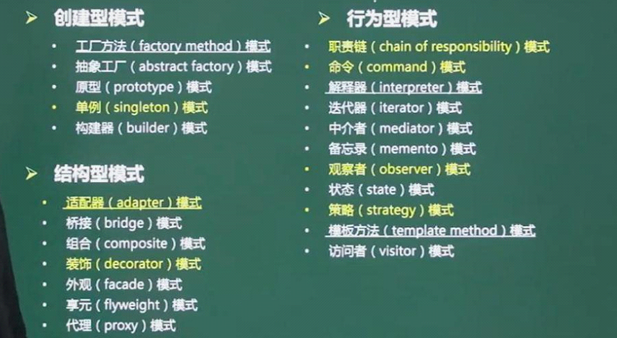

# 面向对象技术

>  12分+

## 基本概念

> * 对象： 属性(数据) + 方法(操作) + 对象ID
> * 类：实体类/控制类/边界类
> * 继承与`泛化`：复用机制
> * `封`装：隐藏对象的属性和实现细节，仅对外公开接口
> * `多态`：不同对象收到同样的信息产生不同的结果
> * `接口`：一种特殊的类，它只有方法没有实现,(Java有，C++中叫抽象类)
> * 重载：一个类可以有多个同名而参数类型不同的函数
> * `模板`类
> * `消息`和`消息通信`：`消息`是`异步`通信的。

## 面向对象设计七大原则

* 单一职责原则：设计目的的单一的类
* 开放-封闭原则：对扩展开放，对修改封闭
* `李氏`(`Liskov`)原则：`子类`可以`替换父类`
* `依赖倒`置原则：要依赖`于抽象`，而`不` 是`具体实现`；针`对接口编程`,`不`要针对实现编程 （`重写会打破`)
* `接口隔离`原则：使用`多个专门`的接口比使用`单一的总接口`要好
* `组合`重用原则：要尽量使用组合，而不是继承关系达到重用目的
* `迪米特(Demeter`) 原则（`最少知识`法则）：一个对象应该对其他对象有较少的了解

# `UML`

> 通用建模语言

> 30分
>
> * 用例图
> * 类图
> * 顺序图
> * 通信图
> * 状态图
> * 活动图

## UML分类

### 结构图

* 类图(重点)

* 对象图
* 包图
* 组合结构图
* 构件图 
* 部署图：软硬件之间映射
* 制品图

### 行为图

* 用例图 ：(重点) 系统与外部参与者的交互
* 顺序图 ：强调按时间顺序
* 通信图 ： 协作图
* 定时图
* 状态图
* 活动图 ：类似程序流程图，并行行为
* 交互概览图

# 设计模式

> 2分，那些设计模式，特点，应用场景，图形表示
>
> 设计模式有23个
>
> * 对应的英文单词
> * 以及所属于的分类

## 设计模式分类

## 创建性模式

|         设计模式名称         | 简要说明                                                     | 速记关键字     |
| :--------------------------: | ------------------------------------------------------------ | -------------- |
| Abstract Factory抽象工厂模式 | 提供一个接口，可以创建一系列相关或相互依赖的对象，而无需指定它们具体的类 | 生产成系列对象 |
|      Builder构建器模式       | 将一个复杂类的表示与其构造相分离，使得相同的构建过程能够得出不同的表示 | 复杂对象构造   |
|  Factory Method工厂方法模式  | 定义一个创建对象的接口，但由子类决定需要实例化哪一个类。工厂方法使得子类实例化的过程推迟 | 动态生产对象   |
|      Prototype原型模式       | 用原型实例指定创建对象的实例，并且通过拷贝这个原型来创建新的对象 | 克隆对象       |
|          Singleton           | 保证一个类只有一个实例，并提供一个访问它的全局访问点         | 单实例         |

## 结构性模式

| 设计模式          | 简要说明                                                     | 速记关键字       |
| ----------------- | ------------------------------------------------------------ | ---------------- |
| Adapter适配器模式 | 将一个类的接口转换为用户希望得到的另一个接口，它使原本不相容的接口得以协同工作 | 转换接口         |
| Bridge桥接模式    | 将类的抽象部分和它的实现部分分离开来，使它们可以独立地变化   | 继承树拆分       |
| Composite组合模式 | 将对象组合成树形结构以表示“整体-部分”的层次结构，使得用户对单个对象和组合对象的使用具有一致性 | 树形目录结构     |
| Decorator装饰模式 | 动态地给一个对象添加一些额的职责，它提供了用子类扩展功能的一个灵活的替代，比派生一个子类更加灵活 | 附加职责         |
| Facade外观模式    | 定义一个高层接口，为子系统中的一组接口提供一个一致的外观，从而简化了该子系统的使用 | 对外统一接口     |
| Flyweight元模式   | 提供支持大量细粒度对象共享的有效方法                         | 文章共享文字对象 |
| Proxy代理模式     | 为其他对象提供一种代理以控制这个对象的访问。                 |                  |

## 行为性模式

| 设计模式名称                      | 简要说明                                                     | 简记关键字       |
| --------------------------------- | ------------------------------------------------------------ | ---------------- |
| Chain of Responsibility责任链模式 | 通过给多个对象处理请求的机会，减少请求的发送者与接受者之间的耦合。将接收对象连链接起来，在链中传递请求，直到有一个对象处理这个请求 | 传递职责         |
| Command命令模式                   | 将一个请求封装为一个对象，从而可用不用的请求对客户进行参数化，将请求排队或记录请求日志，支持可撤销的操作 | 日志记录，可销毁 |
| Interpreter解释器模式             | 给定义中语言，定义它的文法表示，并定义一个解释器，该解释器用来根据文法表示来解释语言中的句子 | 虚拟机的机制     |
| Intertor迭代器模式                | 提供一种方法来顺序访问一个聚合对象中的各个元素，而不需要暴露该对象的内部表示 | 数据库数据集     |
| Mediator中介者模式                | 用一个中介对象来封装一系列的对象交互，它使个对象不需要显式地相互调用，从而达到低耦合，还可以独立地改变对象间的交互 | 不直接引用       |
| Memento备忘录模式                 | 在不破幻封装性的前提下，捕获一个对象的内部状态，并在该对象之外保存这个状态，从而可以在以后将该对象恢复到原先保存的状态 |                  |
| `Observer观察者模式`              | 定义对象间的一种一对都得`依赖关系`，当一个`对象的转改发生改变时`，`所有依赖`它的对象都能够`得到通知`并`自动更新` | 联动             |
| State状态模式                     | 允许一个对象在其内部状态改变时改变它的行为                   | 状态变成类       |
| Strategy策略模式                  | 定义一系列算法，把它们一个个封装起来，并且                   | 多方案切换       |
| Template Method模版方法模式       | 定义一个操作中的算法骨架，而将一些步骤延迟到子类中，使得子类可以不改变一个算法的结构即可重新定义算法的某些特定步骤 |                  |
| Visitor访问者模式                 | 表示一个作用于某对象结构中的各元素的操作，使得在不改变各元素的类的前提下定义作用于这些元素的新操作 |                  |

