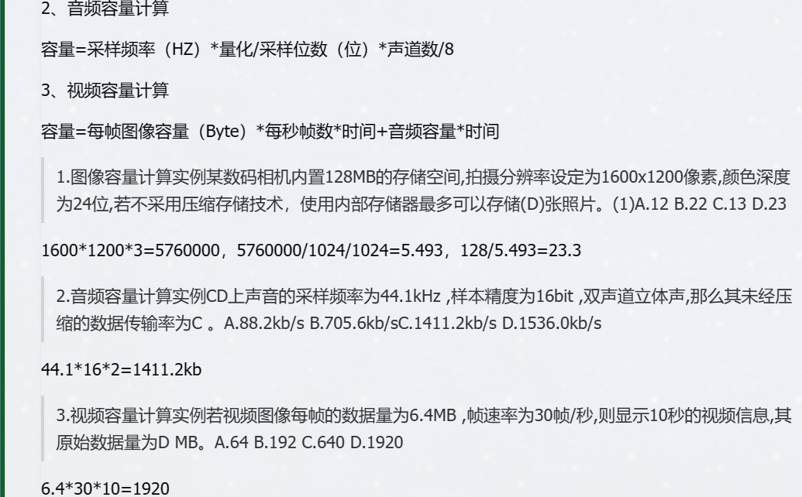

# 多媒体

> 3分左右 

# 内容

* 多媒体技术基本概念
* 多媒体相关计算问题
* 媒体的种类(显示媒体)
* 常见多媒体标准数据压缩技术

# 声音HZ

* `人耳`声音带宽： `20Hz ~ 20KHz`
* `乐器`声音带宽 ： `20Hz ~ 20KHz `
* `说话`声音带宽 ： `300 ~ 3400 Hz`


* 采样 : `采样频率 `=`  1/ 采样周期`

* 采样精度 : `二进制位数`的`精度`

* `采样频率`应为声音`最高频率`的`2倍`，，在数字计算时 大约为` 1~ 1.5` 倍
* `A/D `转换： `采样 `-> `量化` ->`编码`
* 常见音频格式：` WAVE`，`MP3`，`MIDI`

## 音频每秒容量

 `量化 / 采样位数(位) `为 `采样精度`

```
每秒容量 = 采样频率(Hz) X 量化 / 采样位数(位) X 声道数 / 8
```

## 例题：

> CD上声音的采样频率为`44.1`  `KHz` ，`样本精度`为 16 bit，`双声道立体声`，其`未经`压缩的数据传输率位 

```
44.1 k * 16 bit * 2 
```

# 图像

> * `亮度 `
> * 色调 ： `RGB 红绿蓝` 等不同颜色即`色调`。同时`画面整体颜色倾向`，也是`色调`。
> * 饱和度：`饱和度越低`，`越接近灰色` ,`色彩的纯洁性`，即`颜色的艳丽程序`。


## 图形空间大小计算

* 像素位数 ： 决定了色素 

> 容量的结果用 `B `表示 

| 条件           | 示例                                                         |
| -------------- | ------------------------------------------------------------ |
| 知道像数，位数 | 每个像素为16位，图像为640 x 480 像素，求容量 ：  640 x 480 x 16 / 8 =` 614400B` |
| 知道像数，色数 | 640 x 480 像素，256色的图像，求容量 640 x 480 x log2(256) / 8 = `307200 B` |



# 媒体种类

> * `感觉媒体`：是指直接作用于人的感觉器官，使人产生直接感觉的媒体，如 : 声音，图形，图像，动画等。
> * `表示媒体`：指为了加工，处理和传输感觉媒体而人为研究，构造出来的一种媒体，常见的有各种编码方式，如文本编码，图像编码和声音编码等。
> * `显示媒体`(重点)： `输入` `输出` 设备 。表示和获取信息的物理设备，如：输入显示媒体键盘，鼠标和麦克风等，输出显示媒体显示器，打印机和音箱等。
> * `存储媒体`： 存储数据的`物理设备`。
> * `传输媒体`：传输数据的`物理载体`。

# 数据压缩

> * 图像中相邻像素间的相关性 引起空间冗余
> * 图像序列中不同帧之间存在相关性，引起时间冗余
> * 不同彩色平面或频谱带的相关性，引起的频谱冗余。

* 空间冗余(几何冗余) ： 重复性的数据
* 时间
* 视觉
* 信息熵
* 结构 ： 数据结构设计不合理，造成数据冗余，例如关系型数据库中，如果多个表中有相同的字段，就会造成结构冗余
* 知识

* 其它冗余


## 有损压缩

> Lossy Compression ：是一种涉及消除特定数量的技术，有助于减少文件大小在很大程度上没有任何明显的东西。一旦文件被压缩，它就无法恢复到原始状态。因为文件中的数据已经大大减少了，适用于文件的质量不是很重要的时候，此技术会更有用，有助于节省存储数据的磁盘空间。
>
> 当文件十分重要，有损 压缩是没有用的，若有记录需要进一步分析处理，此方法不理想，该方法一般用于音频和视频压缩。此技术通常用于文本文件，敏感文档和机密信息。


## 无损压缩

> 只涉及一定量数据消除技术，此文件被压缩，则可以将其恢复到原始形式，数据质量不受影响，缩小幅度并不大。
>
> 


# 常见多媒体标准


# 参考资料

* [软考自查多媒体基础知识](https://www.cnblogs.com/cainiao-chuanqi/p/10460609.html)