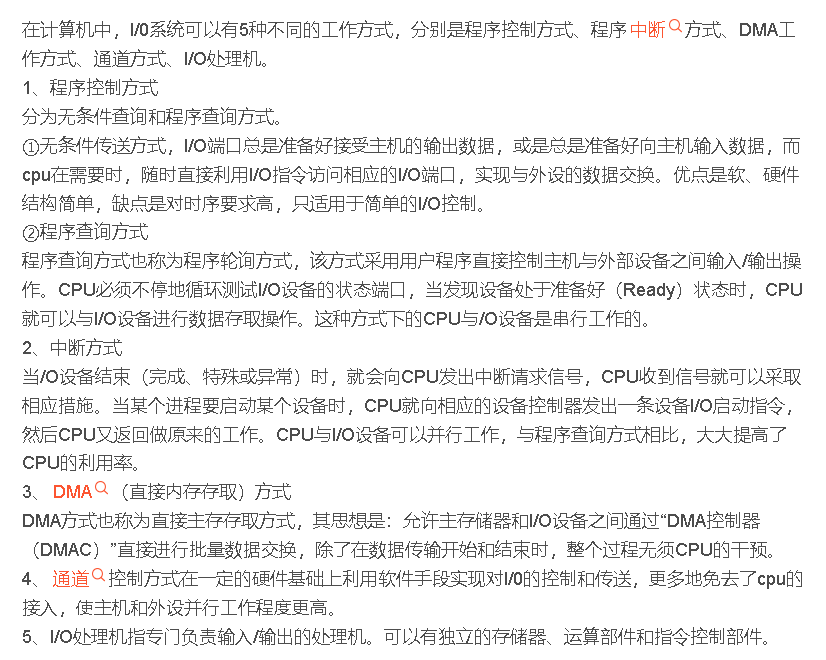

# 软件设计做题笔记01

## 敏捷开发

> `敏捷方法`是一种以人为核心，迭代，循序渐进的开发方法，适用于一开始并没有或不能完整地确认需求和范围的项目，或者需要应对快速变化的环境或者需求和范围难以事先确认，或者能够以有利于干系人的方式定义较小的增量改进。敏捷方法也叫`适应性生命周期`，或者`变更驱动方法`。
>
> 适用于：
>
> * 项目经常发生变更
> * 高风险项目的实施

* `极限编程X`P是激励`开发人员`创造性，使得`管理负担`最小的一组`技术`
* `水晶法Crystal`认为每一个`不同的项目`都需要一套`不同的策略`，`约定`和`方法论`
* `并列争球法(Scrum)`：使用`迭代`的方法，其中把`每30天一次`的`迭代成为一次`冲刺，并按`需求的`优先级来实现产品，并通过`简短的日常`情况会议进行协调。

## 计算机软件著作权

* `中华人民共和国著作权法`
* `计算机软件保护条例`

> [法律条文综述](https://blog.csdn.net/soaipipiop/article/details/126910480)

### 知识产权人的确定

### 委托创作和合作开发知识产权人确定

### 保护期限

## 寻址方式

* `立即寻址`在`操作码字段后面`的部分是`操作数本身`，`数据`就包含在`指令`中，只要去除指令，也就去除了可以立即操作的操作
* `直接寻址`，指令中的`地址码字段` 给出的地址A就是操作数的`有效地址`，即`形式地址`等于`有效地址`。
* `间接寻址`：指令中给出的地址A不是操作数的地址，而是`存放操作数地址`的`主存单元的地`址，简称`操作数地址的地址`
* `寄存器寻址`：其地址码部分给出了某一个通用寄存器的`编号Ri`,这个指定的`寄存器中`存放着`操作数`。

* 解释器参与运行控制，程序执行速度慢
* DMA控制方式允许批量数据交换

<figure><figcaption>
IO控制方式
</figcaption></figure>

* 程序设计语言的大多数语法现象可用其中的 上下文无关文法 描述
* 某一确定有限自动机
* 若某一程序语言可以提供链表的定义和运算，则其运行时数据空间必须采用堆存储分配策略
* 最适合表示浮点数阶码的数字编码是 ： 移码
* 最适合数字加减运算的数字编码是 补码
* Cache的地址映像方式中，发生块冲突最小的  全相联映像
* CPU 在一个总线周期结束时相应DMA请求
* 在UNIX操作系统中，把输入或输出设备看作是   特殊文件
* 有关评估系统效率质量特性：响应时间和交易执行吞吐量都是用来衡量系统执行快慢的
* CPU依据指令周期的不同阶段 来区分在内存中以二进制编码形式存放指令和数据
* 计算机在一个指令周期过程中，从内存读取指令操作码，首先要将 程序计数器PC的内容送到地址总线上
* CPU在执行算术或者逻辑运算时，常把原操作数和结果暂存在 累加器 AC 中

